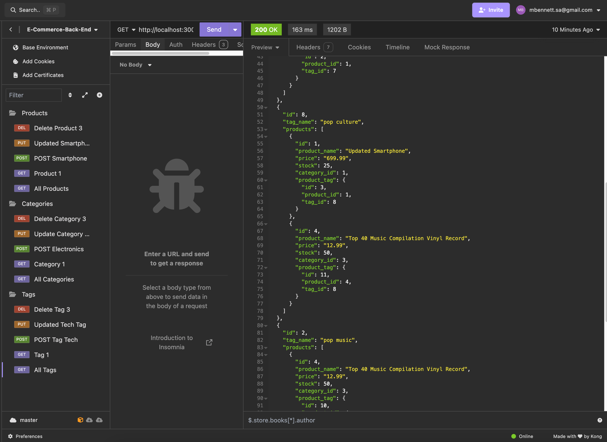

# E-Commerce Backend

## Description
This project is a backend for an e-commerce website that uses the latest technologies to compete with other e-commerce companies. It provides a robust API that allows for management of categories, products, and tags in an e-commerce database.

## Table of Contents
* [Installation](#installation)
* [Usage](#usage)
* [Features](#features)
* [Technologies Used](#technologies-used)
* [License](#license)
* [Contributing](#contributing)
* [Tests](#tests)
* [Questions](#questions)
* [Video Walkthrough](#video-walkthrough)
* [Screenshots](#screenshots)
* [Future Enhancements](#future-enhancements)

## Installation
1. Clone the repository
2. Run `npm install` to install dependencies
3. Set up your PostgreSQL database
4. Create a `.env` file with your database name, PostgreSQL username, and PostgreSQL password
5. Run schema and seed commands to set up the database

## Usage
This application provides an Express.js API that uses Sequelize to interact with a PostgreSQL database. Use API client software like Insomnia to test the various routes:

- GET routes for categories, products, and tags
- POST routes to create new categories, products, and tags
- PUT routes to update existing categories, products, and tags
- DELETE routes to remove categories, products, and tags

## Features
- RESTful API endpoints for categories, products, and tags
- Database seeding for quick setup of test data
- Environment variable configuration for database connection
- Sequelize ORM for database management

## Technologies Used
- Node.js
- Express.js
- PostgreSQL
- Sequelize ORM
- dotenv for environment variable management
- Insomnia (for testing API routes)

## License
NA License

## Contributing
We are not currently accepting contributions to this project.

## Tests
While no formal tests are provided, all API routes can be tested using Insomnia or a similar API client.

## Questions
If you have any questions, please feel free to contact me:
* GitHub: [mlipscomb24](https://github.com/mlipscomb24)
* Email: mbennett.sa@outlook.com

## Video Walkthrough
Here is a link to the video walkthrough of the project:
[Screencastify Video Walkthrough - GET and POST](https://app.screencastify.com/v3/watch/0TakpcNLniOfZxReHRyI)
[Screencastify Video Walkthrough - PUT and Delete](https://app.screencastify.com/v3/watch/ZSrah7ui4UG24L7PlGiU)

## Screenshots

## Future Enhancements
- Implement user authentication and authorization
- Add more complex querying capabilities
- Integrate with a front-end application
